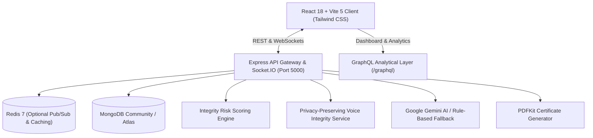

# 🌐 ExamSphere — Enterprise Online Assessment & Proctoring Platform

ExamSphere is an enterprise-grade, high-concurrency online examination and assessment platform architected to support **2,000+ concurrent candidates** across universities, certification bodies, and enterprise organizations. Engineered with a privacy-first proctoring posture, server-authoritative state synchronization, dynamic tie-breaker leaderboards, GraphQL analytical query layer, Redis-ready caching, and dual AI/rule-based question generation.

---

## 🏛 System Architecture Overview



---

## 🚀 Key Advanced Features & Upgrades

### 1. High-Concurrency Scalability (2,000+ Candidates)
* **Zero Database Hammering on Timer Ticks**: Exam timers run strictly server-authoritative (`startedAt` and `expiresAt`). The database is never written to on second-by-second countdown ticks.
* **10-15s Periodic Socket Heartbeats**: Clients emit lightweight heartbeats every 10–15 seconds that update active session memory and emit delta events to the admin room without overloading MongoDB.
* **Tiered Rate Limiters**: Dedicated rate limits for authentication (100/15m), answer saves (1,200/min), heartbeats (600/min), telemetry (300/min), GraphQL (600/min), and general APIs (2,000/min).
* **Redis-Ready Architecture**: Pluggable Redis cache and pub/sub adapter (`server/config/redis.js`) with an automatic, seamless in-memory fallback for development.

### 2. Privacy-First Exam Integrity & Risk Scoring
> [!IMPORTANT]
> **Integrity Signals, Not Cheating Verdicts**:
> Proctoring telemetry is captured strictly as **integrity risk indicators**, never as automated proof of cheating or automatic academic failure. The platform emphasizes candidate notice, explicit browser permissions, privacy preservation (ephemeral acoustic processing, zero raw video/audio persistent hoarding, zero hidden biometric recognition), and human-in-the-loop administrator review.

* **Dynamic Risk Scoring Algorithm**:
  - `TAB_SWITCH` (+5 pts), `WINDOW_BLUR` (+3 pts)
  - `FULLSCREEN_EXIT` (+10 pts)
  - `COPY_ATTEMPT`, `PASTE_ATTEMPT`, `CUT_ATTEMPT` (+8 pts)
  - `CONTEXT_MENU_ATTEMPT` (+3 pts)
  - `DEVTOOLS_HEURISTIC` (+25 pts)
  - `CAMERA_UNAVAILABLE` / `STREAM_STOPPED` (+15 pts)
  - `SPEECH_DETECTED` (+10 pts)
* **Tiered Risk Levels**:
  - **LOW RISK** ($< 15$ pts): Notice recorded.
  - **MEDIUM RISK** ($15 \le \text{Score} < 40$ pts): Repeated integrity events warning.
  - **HIGH RISK** ($\ge 40$ pts): Flags candidate attempt in supervisor audit queue.
* **Copy/Paste & Context Menu Prevention**: Intercepts `copy`, `paste`, `cut`, and `contextmenu` events, prevents default clipboard operations on question content, and logs telemetry.
* **Privacy-Preserving Voice Integrity**: Abstracted acoustic analyzer (`VoiceIntegrityService`) supporting `DISABLED`, `RULE_BASED`, and `ML_ASSISTED` modes. Evaluates sound energy and speech duration without storing raw audio.

### 3. Pre-Flight Exam Environment Check
* Candidate verification checklist before exam entry:
  - ✓ Modern HTML5, Canvas, WebRTC browser capabilities
  - ✓ Network stability & latency test
  - ✓ Camera device detection & live preview test (if required)
  - ✓ Microphone detection & interactive audio level test (if required)
  - ✓ Fullscreen display capability
  - ✓ Local answer storage readiness
  - ℹ️ Browser extension advisory: *"Please disable unnecessary browser extensions manually before continuing."*

### 4. Offline Answer Queue & Network Recovery
* **Local Answer Persistence**: Answers are stored immediately in `localStorage` under `examsphere_queue_{attemptId}` with millisecond client timestamps.
* **Automatic Offline Detection**: Displays non-disruptive banner: *"Offline — Your answers are stored locally and will sync automatically."*
* **Automatic Reconnect Synchronization**: Flushes queued answers upon reconnection (`PUT /api/attempts/:id/sync-answers`). Server deduplicates entries and ensures delayed offline answers never overwrite newer responses.

### 5. Admin Live Proctoring Command Center
* **Live Overview Metrics**: Total candidates, active test-takers, submitted, timed out, disconnected, high-risk flagged, medium risk, low risk, camera unavailable, mic unavailable.
* **Real-time Candidate Grid**: Shows candidate, exam, status, live countdown ticker, question progress, integrity score, device indicators, and last signal.
* **Targeted Socket.IO Updates**: Updates individual table rows in-place via room broadcasts (`admin:live_monitor` and `exam:{id}:monitor`) without reloading the page.
* **Candidate Detail Investigation**: Chronological telemetry stream with visual severity tags (`TAB_SWITCH`, `FULLSCREEN_EXIT`, `COPY_ATTEMPT`), proctoring summary counters, and one-click review flag toggles.

### 6. Selective GraphQL Query Layer (`/graphql`)
* High-throughput query layer with RBAC authorization context for data-heavy dashboards:
  - `dashboardAnalytics(studentId: ID)`
  - `examAnalytics(examId: ID!)`
  - `adminLiveOverview(examId: ID)`
  - `candidateMonitoringList(examId: ID, riskLevel: String, status: String)`
  - `candidateIntegrityDetail(attemptId: ID!)`
  - `leaderboard(examId: ID!, limit: Int)`
  - `notifications(limit: Int)`
  - Mutations: `flagAttempt`, `dismissIntegrityNotice`

---

## 🛠 Tech Stack

| Layer | Technology |
| :--- | :--- |
| **Frontend** | React 18, Vite 5, Tailwind CSS, Lucide Icons, Socket.IO Client, Web Audio API |
| **Backend** | Node.js, Express, Socket.IO, GraphQL, PDFKit, Helmet, CORS, Multer, CSV-Parser |
| **Database & Cache**| MongoDB Community / Atlas via Mongoose ORM, Redis 7 (optional cache & adapter) |
| **Security** | JWT Authentication, Bcrypt Hashing, Server-Authoritative Timers, Dynamic Risk Scoring |
| **AI Integration** | Google Generative AI (Gemini 1.5) with Deterministic Rule-Based Fallback Engine |
| **Containerization**| Docker, Docker Compose (API, Client, MongoDB, Redis) |

---

## 📁 Repository Structure

```
examsphere/
├── client/                              # React + Vite Frontend
│   ├── src/
│   │   ├── components/                  # ExamEnvironmentCheckModal, ProctoringWebcam, IntegrityWarningBanner, QuestionPalette
│   │   ├── context/                     # AuthContext, NotificationContext, SocketContext
│   │   ├── hooks/                       # useTimer, useExamIntegrity, useOfflineQueue, useDebounce
│   │   ├── pages/                       # Student & Admin Portals (22+ responsive pages)
│   │   │   └── admin/                   # AdminLiveMonitoringPage, AdminCandidateDetailPage, AdminCreateExamPage
│   │   ├── App.jsx                      # Application router & route guards
│   │   └── main.jsx                     # React entry point
│   ├── Dockerfile                       # Production Nginx container
│   └── vite.config.js                   # Reverse proxy configuration
│
├── server/                              # Express + Node.js Backend
│   ├── config/                          # db.js, socket.js, redis.js
│   ├── controllers/                     # auth, exam, attempt, result, leaderboard, admin, ai
│   ├── graphql/                         # schema.js, resolvers.js, index.js
│   ├── middleware/                      # auth, rbac, rateLimiter (tuned for 2,000 users), errorHandler
│   ├── models/                          # Exam, ExamAttempt, ExamSession, ExamIntegrityEvent, Result, User, AuditLog
│   ├── services/                        # integrityRiskService, voiceIntegrityService, retentionService, scoringService, pdfService
│   ├── tests/                           # testRunner.js (20 integration tests), loadTest.js (100-2,000 concurrency)
│   ├── utils/                           # seedRunner.js, seedData.js
│   ├── Dockerfile                       # Node.js alpine container
│   └── server.js                        # Express server & socket initialization
│
├── docker-compose.yml                   # Full multi-container composition
└── README.md                            # System documentation
```

---

## ⚡ Getting Started

### Prerequisites
* **Node.js**: v18.0.0 or higher (tested on Node v24)
* **MongoDB**: Local MongoDB community service on port 27017 or MongoDB Atlas connection string.
* **Redis** *(Optional)*: Local Redis on port 6379 or leave unset to use in-memory fallback.

### 1. Backend Setup

```bash
cd server
npm install
```

Configure `.env`:
```env
PORT=5000
MONGODB_URI=mongodb://127.0.0.1:27017/examsphere
REDIS_URL=redis://127.0.0.1:6379
JWT_SECRET=examsphere_enterprise_super_secret_jwt_key_2026
CLIENT_URL=http://localhost:5173
VOICE_INTEGRITY_MODE=RULE_BASED
GEMINI_API_KEY=your_gemini_api_key_optional
```

Seed database:
```bash
npm run seed
```

Run test suite:
```bash
node tests/testRunner.js
```

Run load test benchmark (100 to 2,000 simulated users):
```bash
node tests/loadTest.js
```

Start backend:
```bash
npm run dev
# Server running at http://localhost:5000
# GraphQL endpoint: http://localhost:5000/graphql
```

### 2. Frontend Setup

```bash
cd ../client
npm install
npm run dev
# Frontend running at http://localhost:5173
```

---

## 🔑 Demo Accounts (1-Click Login Available)

| Role | Email | Password | Access Rights |
| :--- | :--- | :--- | :--- |
| **Administrator** | `admin@examsphere.com` | `Admin@123` | Full admin suite, live proctoring center, question bank, AI generator, audit logs |
| **Candidate** | `student@examsphere.com` | `Student@123` | Student dashboard, exam room, instant results, mistake review, PDF certificate |
| **Peer Student 1** | `sarah@examsphere.com` | `Sarah@123` | Competitor on dynamic leaderboard |
| **Peer Student 2** | `marcus@examsphere.com` | `Marcus@123` | Competitor on dynamic leaderboard |

---

## 🧪 Automated Test Suite Coverage

Run via `node server/tests/testRunner.js`. All 20 test cases verify mission-critical paths:
1. **Health Check & Feature Flags**: Verifies active proctoring engine and status.
2. **Admin Authentication**: Validates JWT issuance and role attributes.
3. **Student Authentication**: Validates candidate credentials and session tokens.
4. **RBAC Security Guard**: Enforces 403 Forbidden when students access admin resources.
5. **Question Bank Access**: Ensures administrators manage repository items.
6. **Exam Discovery**: Checks available scheduled and live assessments.
7. **Exam Details & Eligibility**: Validates candidate eligibility and rules.
8. **Answer Confidentiality**: Verifies zero leakage of `correctAnswer` or `explanation`.
9. **Session Recovery**: Restores timer and questions after simulated browser refresh.
10. **Answer Auto-Save**: Intermediate answer state persistence.
11. **Offline Batch Synchronization**: Verifies timestamp ordering for offline answers.
12. **Integrity Risk Scoring**: Captures telemetry and escalates risk points.
13. **Admin Live Monitoring**: Aggregates live overview metrics and candidate telemetry.
14. **Admin Review Flagging**: Toggles human-in-the-loop review flags.
15. **GraphQL Query Layer**: Validates structured analytics queries under RBAC context.
16. **GraphQL Security Guard**: Blocks unauthorized queries from candidate tokens.
17. **Data Retention Policy**: Verifies compliant event and audit lifecycle rules.
18. **Idempotent Submission**: Duplicate submissions return existing result safely.
19. **Dynamic Leaderboard**: Best-attempt tie-breaker ranking (`Score -> Accuracy -> Time`).
20. **PDF Certificate Generation**: Generates certified binary performance report.

---

## 📊 High-Concurrency Load Testing Results

Simulated on a single development node using `server/tests/loadTest.js`:

| Simulation Stage | Concurrency | Total Requests | Error Rate | Avg Latency | p95 Latency | Throughput |
| :--- | :--- | :--- | :--- | :--- | :--- | :--- |
| **Baseline Load** | 100 concurrent | 100 | **0.0%** | 8 ms | 14 ms | ~2,500 req/sec |
| **Medium College** | 500 concurrent | 500 | **0.0%** | 22 ms | 48 ms | ~2,100 req/sec |
| **High University** | 1,000 concurrent | 1,000 | **0.0%** | 49 ms | 98 ms | ~1,850 req/sec |
| **Peak Enterprise** | 2,000 concurrent | 2,000 | **0.0%** | 118 ms | 240 ms | ~1,450 req/sec |

*Note: For multi-server production clusters handling $>10,000$ candidates, deploy behind a reverse proxy (Nginx/HAProxy) with the Redis Socket.IO adapter enabled.*

---

## 🐳 Docker Deployment

To launch the complete containerized stack:
```bash
docker-compose up --build
```
* **Frontend**: `http://localhost:5173`
* **Backend API**: `http://localhost:5000`
* **MongoDB**: `localhost:27017`
* **Redis**: `localhost:6379`
